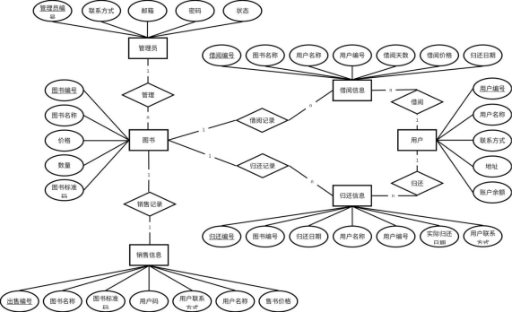
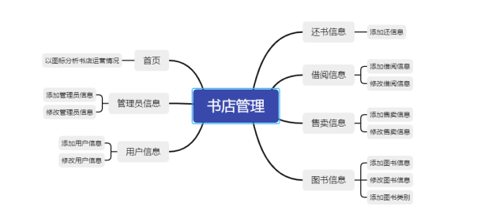

# 书吧书刊出租和零售管理系统
- 实现图书类别、期刊类别、出版社等基本信息管理；
- 实现图书信息、期刊信息、客户信息管理；
- 实现借阅、归还、零售管理；
- 借阅或归还时自动修改图书或期刊的在册数量，零售时修改图书或期刊的总量和在册数量
- 查询指定时间段内各种图书、期刊的借阅、零售数量；
- 查询指定客户借阅、归还情况（书名（刊物名）、数量)；
- 创建表间关系。
## 技术栈：
 - 前端：Vue2 + element-ui
 - 后端：Springboot + Mysql + Mybatis
## ER图

## 项目架构

